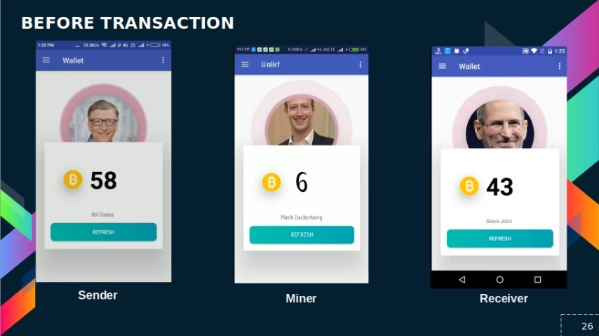

# Blockchain Based Cryptocurrency Prototype
   
   

 

## About
- Android based Cryptocurrency Prototype  & Blockchain  Simulator with Mining
- Following Project is a Prototype of Crptocurrency running on Distrubuted Ledger-BlockChain Technology and Visual Simulator for           Blockchain

## Insight
- Hashing : md5
- Mining Algorithm : Proof of Work
- Difficulty : Meduim (Hash to start with 000x)
- Ledger File: Sqlite File (.db)
- Dependecies :
  - Android Studio
  - Firebase Services
  - Sqlite
  - ZXing 

## Blockchain  Simulator
- The Blockchain Sinmualtor makes it Efficently to visualize the Working of Blockchain.
  - User can create Block and can Enter data in blocks
  - The User can set Dificullty of Mining 
  - When Perfect Nonce is occured the block is created and all the attributes like a hashvalue , timestamp ,nonce , blockid and data can     be seen
  - If any one tries the change the data in Between the blocks the conflict happens and previous block to that is decleared invalid
  -The CheckSum is also Provided which checks validity of whole blockchain

## Cryptocurrency Prototype

 - On basis of the above simulator the Cryptocurrency prototype is created where user can experience server-database less crypotcurrency    stored in distrubuted ledger

### Features

- Create a Wallet and Gert Unqiue address and QR code
- Send Money to Other Account using App
- Recive Money
- Do Mining On Mobile and Earn Extra Crypto Coins

 

### WORKING

- A ledger File is created which have all the attributes in blockchain stored a record such as Transaction Details like Sender ,Reciver    , etc  and Block Details like Hash , Nonce ,etc
- Every SIngle User has a copy of distrubuted Ledger File
- When Someones request a transaction he fisrt updates his Ledger with Current Ledger File and Create A Request for Transaction
- The Minner Recives the Request he also updates his Ledger with Current Ledger and try to find the nonce for new transaction
- As Proof of work is done he adds new block on blockchain in that ledger and    
  brodcasts it as Global ledger
- All the Other Peers downloads  the Global Ledger  does the checksum and finds out the current balance of accounts

    

## License

MIT &copy; Atharva Udapure
